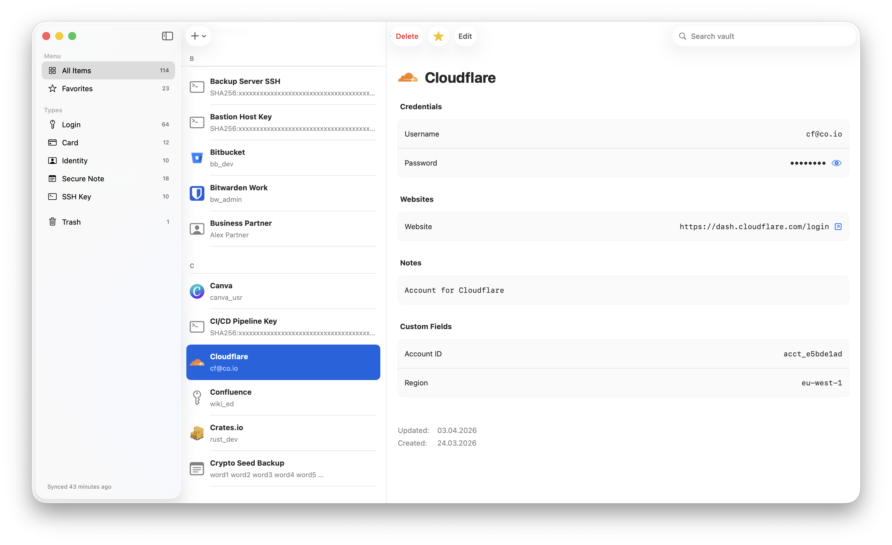

<div align="center">


# Vitrine

[](https://github.com/lemonevo/vitrine/actions/workflows/ci.yml)
[](https://swift.org/)
[](https://www.apple.com/macos/)
[](LICENSE)

原生 macOS 客户端，连接 Vaultwarden 与自建 Bitwarden。用 Swift 写成。

*你的秘密。你的服务器。我们的界面。*

[English](README.md) · [简体中文](README.zh-Hans.md)

</div>

---

<picture>
  <source media="(prefers-color-scheme: dark)" srcset="assets/screenshot_dark.png">
  
</picture>

---

## 为什么做 Vitrine

官方 Bitwarden 桌面端是 Electron 写的——一层 Chromium 网页外壳。它能用，但它不像 Mac 应用：
菜单、键盘响应、滚动、自动填充，都是浏览器的，不是系统的。

Vitrine 是同一个自建服务器上的**完全原生** SwiftUI 客户端。一个进程，用系统自己的控件，遵守平台
自己的约定，因为它是用平台自己的框架做的。

如果你把密码放在自己服务器上、并且在意自己机器上的软件质量，Vitrine 就是给你的。

## 隐私

Vitrine 不收集任何东西。没有遥测、没有统计、没有崩溃上报、没有使用数据。也没有 Vitrine 的服务器：
应用只和你自己的 Vaultwarden / Bitwarden 通信，什么都不往外送。

官方客户端有两项功能，这里是**故意不做**的，理由相同：**已泄露密码检查**要把密码的一部分发给
第三方；**转发邮箱别名**要让注册流程经过第三方。二者都是拒绝，而不是"还没做"——在你可能去找
它们的那两个界面上，应用直接写明了原因。

## 安全

- **Argon2id 密钥派生**（RFC 9106，内存硬）——如果你的账号当初是用 PBKDF2 建的，就用 PBKDF2：
  这件事由服务器决定，客户端跟随。
- **AES-256-CBC + HMAC-SHA256**，先加密后认证，每个字段独立 IV，全程**没有自创密码学**：
  每一个算法都是有公开规范的标准。
- **密钥只存在 macOS 钥匙串里**，仅本机、不参与同步，并且**锁定保险库时会被清零**。

[SECURITY.md](SECURITY.md) 有完整的威胁模型、算法规格，以及同样重要的——应用**不能**防住什么。
[ACCESSIBILITY.md](ACCESSIBILITY.md) 是 WCAG 2.1 符合性声明。

## 功能

**保险库本身**

- 五种条目类型全部可读可写：登录、信用卡、身份、安全笔记（九种子类型）、SSH 密钥；可复制、可删除、可恢复
- 文件夹（支持嵌套与拖放）、收藏夹、回收站（恢复与永久删除）
- 组织与集合，包括在你的角色允许时创建和重命名集合
- 附件：上传、下载、打开、删除，并支持拖放批量上传
- 全库搜索，命中的文字在列表里高亮

**进去**

- 主密码、PIN 或 Touch ID 解锁。PIN 是**用密钥包裹**的而不是记一个开关，所以五次输错会直接移除它并登出
- 两步登录：验证器应用、YubiKey OTP、邮件；另有一个账户指纹短语，可以线下比对
- 自动锁定：空闲、睡眠、屏保；间隔与动作都可配置
- 单条目的主密码 re-prompt：标记过的条目会一直受保护

**动态码与密钥**

- 任何存了一次性密钥的登录项都能生成 TOTP 动态码，在设备本地派生，带实时倒计时
- **动态验证码**这个目标把全库的码集中在一处列出，可搜索、可排序——要登录某个站点时，不必先去翻出那条记录
- 密码 / 口令短语 / 用户名生成器，以及条目上 passkey 的只读查看
- **SSH agent**：通过本地 socket 把保险库里的密钥提供给 `ssh` 和 `git`，已经在库里的密钥不必再复制一份到 `~/.ssh`
- 证书固定：按服务器决定，首次连接时记录，之后每次连接都重新校验

**其它**

- 离线读取上次同步的缓存副本，并明确告诉你那份副本是什么时候的
- 保险库健康报告：弱密码、重复使用、长期未改、缺第二因子
- 导入导出：Bitwarden 未加密 JSON，登录项还可导出 CSV；跳过了哪些条目会**逐条报告**，而不是给你一个悄悄变小的文件
- 英文与简体中文，可在设置里切换，也可跟随系统
- 每个控件都有 VoiceOver 标签、可键盘导航，并遵循"减弱动态效果"与"增强对比度"

## 运行要求

- macOS 26 或更高
- 自建的 [Vaultwarden](https://github.com/dani-garcia/vaultwarden) 或 [Bitwarden](https://bitwarden.com/) 服务器

针对 Vaultwarden 1.35.4 验证过。更新的版本通常可用；更旧的没有验证。

## 安装

**没有 Homebrew tap**，而且 `brew install --cask prizm` 装的是**另一个应用**——本项目 fork 的上游
项目，它仍用旧名字、有自己的发布。两者不能互换。

**从源码构建**——目前唯一可行的路径：

```bash
git clone https://github.com/lemonevo/vitrine.git
cd vitrine
cp Prizm/LocalConfig.xcconfig.template Prizm/LocalConfig.xcconfig
# 在 LocalConfig.xcconfig 里填上你的 Apple Team ID，然后：
open "Prizm/Prizm.xcodeproj"
```

完整的搭建步骤（包括怎么拿到免费的 Team ID）见 [DEVELOPMENT.md](DEVELOPMENT.md)。

**预编译下载**在发布之后会出现在 [Releases](https://github.com/lemonevo/vitrine/releases)。产物
**未签名、未公证**——签名需要一个本项目没有的 Apple 开发者账号——所以首次打开时 macOS 会拒绝。请**右键（或 Control 点击）它 → 打开 → 确认**，只需做一次。首次启动 macOS 还会请求使用
你的登录钥匙串：点**允许**。或者从终端执行：

```bash
xattr -dr com.apple.quarantine /Applications/Vitrine.app
```

## 快捷键

| 快捷键 | 操作 |
|---|---|
| ⌘F | 搜索保险库 |
| ⌘N | 新建条目 |
| ⌥⌘N | 新建窗口 |
| ⌘E | 编辑选中条目 |
| ⌘S | 保存在编辑的条目 |
| ⌘D | 复制选中条目 |
| ⇧⌘C | 复制用户名 |
| ⌥⌘C | 复制密码 |
| ⌃⌘C | 复制选中条目的一次性验证码 |
| ⌥⇧⌘C | 复制网站 |
| ⌘R | 立即同步 |
| ⌘L | 锁定保险库 |
| ⇧⌘H | 保险库健康报告 |
| ⇧⌘E | 导出保险库 |
| ⇧⌘I | 导入保险库 |
| ⇧⌘Q | 退出登录 |
| 按住 ⌥ | 显示被遮罩的字段 |
| ⌘, | 设置 |

它们都可以在**系统设置 → 键盘 → 键盘快捷键 → App 快捷键**里改：为 Vitrine 添加一条规则，
名称填菜单项的**原文**即可。

## 路线

| 正在做 | 接下来 | 更远 |
|---|---|---|
| 离线写入 | 多账号 | 原生 macOS 自动填充 |
| | Bitwarden 官方云账号 | passkey 的创建与登录 |
| | 冲突合并（检测已实现） | 读取 KDBX 4（KeePass） |

**正在做**是真的在做；**接下来**有排期；**更远**只是一张清单，没有时间表。优先级由 issue 决定，
不由这张表决定——想让某一项提前，说一声。

## 已知限制

- **没有公证。** 没有 Developer ID，所以应用是未签名的，需要上面那步"右键 → 打开"。
- **没有浏览器自动填充。** 没有 Safari 扩展，也没有系统级凭据提供者，所以目前的工作方式是复制粘贴。
  这是相对官方客户端最大的一处差距，补上它需要一个 Apple 开发者账号。
- **passkey 只读。** 条目上的 passkey 可以列出，但 Vitrine 不能创建，也不能用它登录。
- **SSH agent 需要非沙箱构建。** agent 监听的 socket 必须能被 `ssh` 访问，而沙箱化的构建建不出来。
  这种情况它会在设置里说明原因，而不是静默失败；`./build-app.sh` 构建出来的版本可以运行它。
- **不能离线写入。** 读取可以用上次同步的缓存副本；创建和编辑需要连接服务器。
- **附件上限 500 MB**；另外 Bitwarden 官方托管服务本身要求付费订阅才能用附件，Vaultwarden 没有这个限制。
- **需要 macOS 26。** 界面用到了更早版本没有的 SwiftUI 特性。

## 参与开发

构建、测试命令与架构概览见 [DEVELOPMENT.md](DEVELOPMENT.md)。

改动走 **openspec** 流程：每一项都在 `openspec/changes/<name>/` 下有 proposal、design 和任务清单，
**写在代码之前**。`openspec/` 里是进行中和已归档的条目。

欢迎提交 PR。比较大的改动请先开一个 issue。

## 使命与原则

Vitrine 存在的意义，是让 macOS 用户能用一个原生、可审计、可信的界面，连上自己托管的密码库。

**原生优先。** SwiftUI、系统控件、平台约定。不要 Electron，不要网页视图，不在"一个 Mac 应用该是
什么样"上妥协。

**安全优先。** 不自创密码学；每一条安全决策都写在你查得到的地方——包括那些因此放弃掉的功能。

**彻底透明。** 这是安全软件。你应该能读代码、跟上密码学，然后自己判断要不要信任它。这就是它开源、
也就是 `SECURITY.md` 那么长的原因。

**简单诚实。** 只做需要的东西。不支持的就说不支持。没有暗黑模式，没有增长手段，没有遥测。

---

*与 Bitwarden, Inc.、8bit Solutions LLC 及 Vaultwarden 项目无隶属关系。*

*Vitrine 最初是 [Prizm](https://github.com/b0x42/prizm)（作者 Benjamin）的 fork，他依 MIT 许可仍是
版权持有人。此后本项目经过重新设计并大部分重写；两者是不同的项目，改名就是在说明这一点。*
